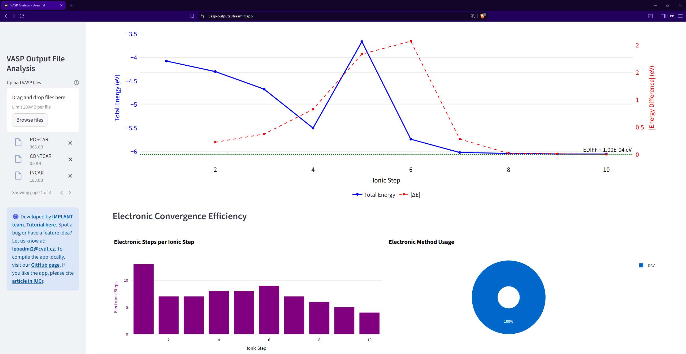
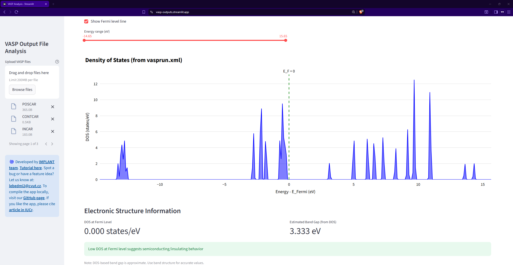
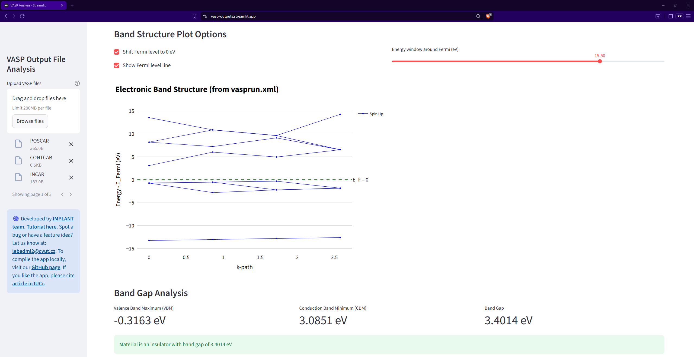
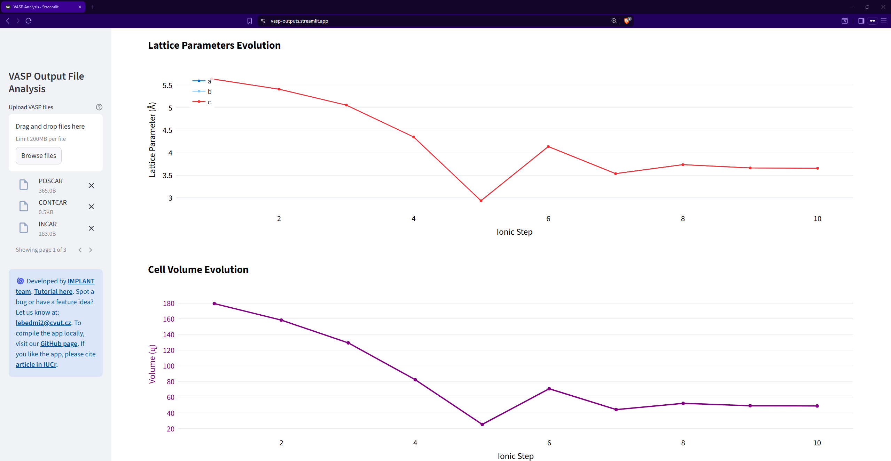
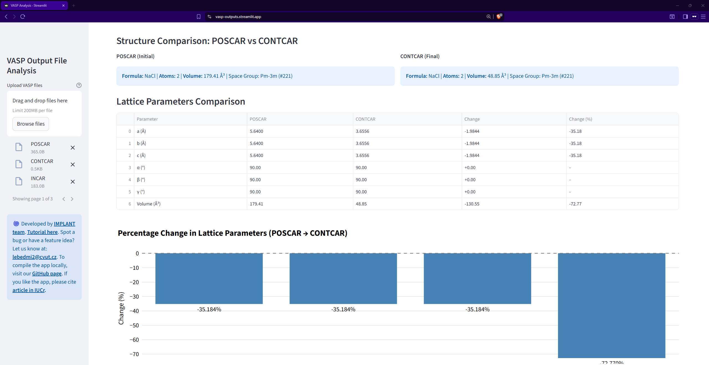
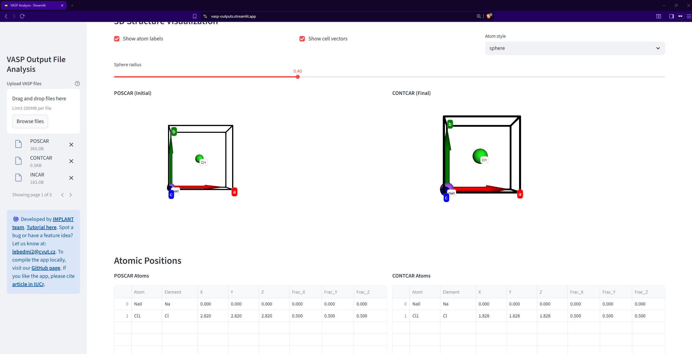
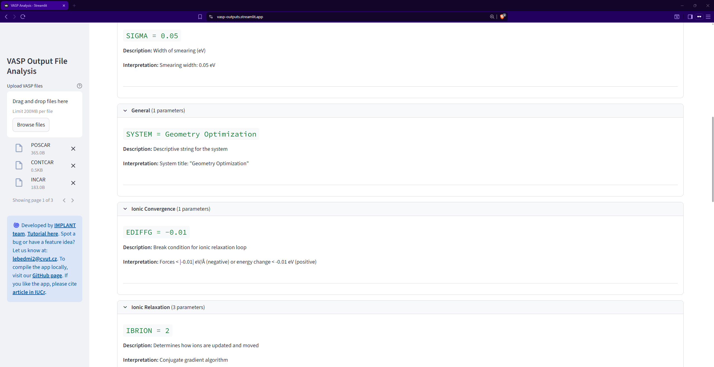

# VASP output files analysis with interactive online interface
Online interface for quick VASP output files analysis.  
Access the app here: https://vasp-outputs.streamlit.app/  
Upload OSZICAR, INCAR, DOSCAR, EIGENVAL, KPOINTS, POSCAR, CONTCAR, vasprun.xml to obtain convergence of total energy on the ionic step from geometry optimization, plot the eletronic band structure and density of states, or compare the differences between the initial and the optimized crystal structure.

